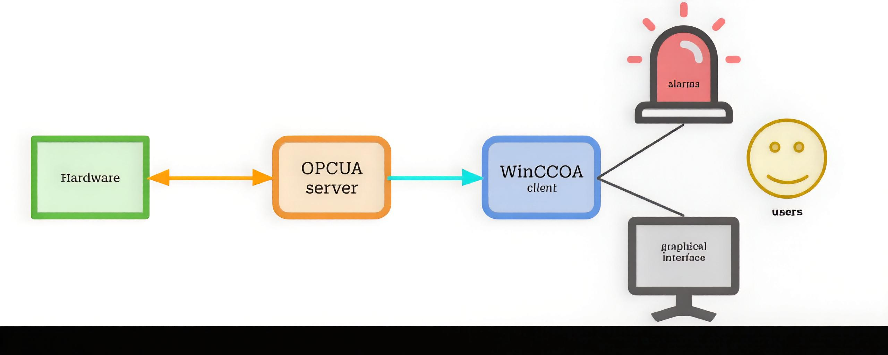
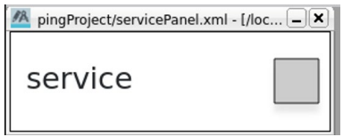
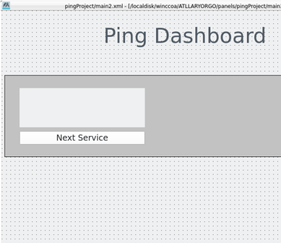
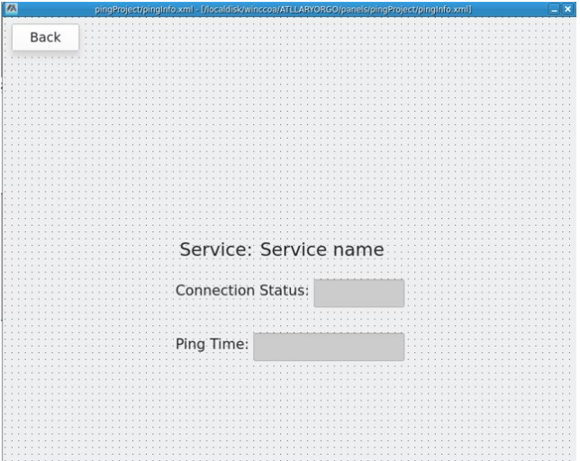
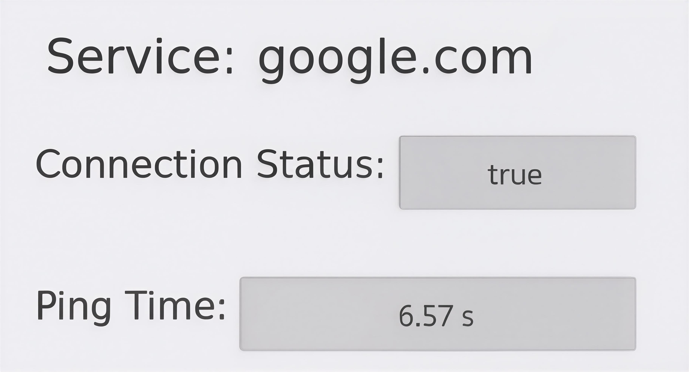
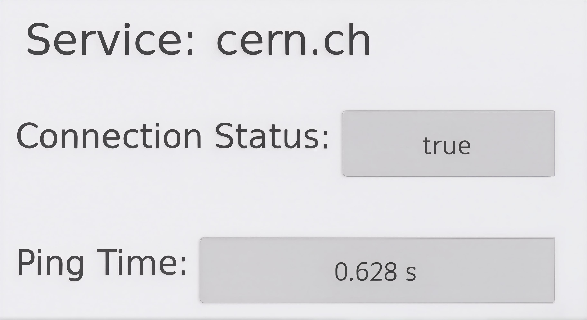
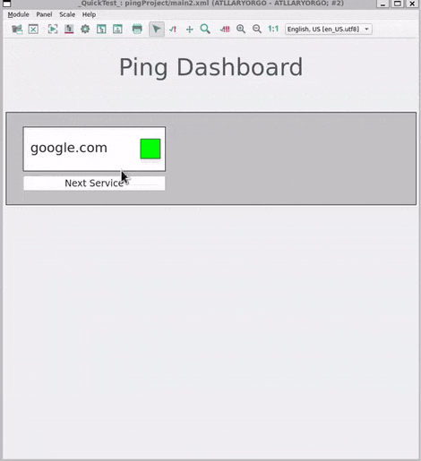

# CERN Quasar OPC UA Service Ping Monitoring Project

This is my main flagship project during my CERN internship (Summer 2025), showcasing a real-time OPC UA service monitoring system integrated with a Human-Machine Interface (HMI) in WinCC OA.

The project demonstrates my C++ expertise, understanding of OPC UA protocols, cache variable handling, and industrial-grade HMI design, while providing real-time insights into service latency and connectivity.



---

## 🎯 Project Objectives
The goal was to build a high-performance bridge between low-level system diagnostics and industrial visualization.

* **Real-Time Monitoring:** Track health and latency for services like `google.com`, `cern.ch`, and `firefox.com`.
* **Data Exposure:** Provide live metrics via the **OPC UA protocol** for industrial standard communication.
* **HMI Integration:** Design an interactive **WinCC OA dashboard** for real-time operator navigation.
* **Validation:** Verify data integrity using **UaExpert** and live SCADA feedback.

---

## 🏗️ Class Hierarchy
The server is built using the **Quasar framework** with a scalable parent-child architecture.

### **DService (Parent Class)**
* **Role:** Acts as the manager for all monitored network nodes.
* **Logic:** Executes a custom `update()` loop that triggers system-level pings and pushes data to the OPC UA address space.

### **Service Instances (Child Objects)**
Each instance represents a specific monitored URL with the following **Cache Variables**:

| Variable | Type | Access | Description |
| :--- | :--- | :--- | :--- |
| `ping_state` | Boolean | Read-only | Indicates if the host is reachable. |
| `ping_time` | Double | Read-only | Captured round-trip latency in milliseconds. |
| `serviceURL` | String | Read-only | The target address defined in the configuration. |


---

## Technical Implementation (C++)
The core of the project is the DService class. I implemented a robust update() loop that interfaces with the Linux kernel to execute asynchronous ping requests and parse the raw data into the OPC UA address space.

### Feature Highlight: The Ping Logic
I utilized **popen** to open a pipe to the system shell, allowing the **C++ server** to capture and interpret network diagnostics in real-time.

```cpp
/* DService.cpp - Logic for Real-time Latency Capture */

void Device::DService::update() {
    // 1. Construct the system command
    std::string cmd = "ping -c 1 " + host_url + " 2>&1";

    // 2. Open pipe to shell and read output
    std::unique_ptr<FILE, decltype(&pclose)> pipe(popen(cmd.c_str(), "r"), pclose);
    
    // ... Parsing Logic ...

    // 3. Extract latency and update OPC UA Address Space
    auto pos = result.find("time=");
    if (pos != std::string::npos) {
        auto ms_start = pos + 5;
        auto ms_end = result.find(" ms", ms_start);
        std::string time_str = result.substr(ms_start, ms_end - ms_start);

        double ping_time_ms = std::stod(time_str);
        
        // Update the server's cache variables
        getAddressSpaceLink()->setPing_time(static_cast<OpcUa_Double>(ping_time_ms), OpcUa_Good);
        getAddressSpaceLink()->setPing_state(true, OpcUa_Good);
    }
}
```

---


## 🖥️ HMI Overview (WinCC OA)
The HMI was designed to **CERN industrial standards (859 × 849 px)**, providing an interactive interface for real-time monitoring. The front-end communicates directly with the C++ OPC UA back-end to visualize network diagnostics.

### **Panel Architecture**

| **Service Panel** | **Main Dashboard** | **Child Detail Panel** |
| :--- | :--- | :--- |
|  |  |  |
| **Displays:** Service name and dynamic status indicators. | **Role:** Central hub for gateway management. | **Role:** Granular diagnostic view for specific nodes. |
| **Logic:** Color-coded (Grey/Green/Red) based on `ping_state`. | **Feature:** Custom **Next Service** navigation logic. | **Logic:** Direct link to `ping_state` and `ping_time` variables. |

---

### 🎨 Visual Feedback Logic
To ensure immediate operator awareness, I implemented a traffic-light status system:
* ⚪ **Grey (Unknown):** Initializing or service not yet checked.
* 🟢 **Green (Connected):** Successful ICMP response received.
* 🔴 **Red (Disconnected):** Service unreachable or timeout occurred.

> [!NOTE]
> All fields in the **Child Detail Panel** are configured as read-only to maintain data integrity and serve as high-fidelity live indicators for the operator.
---

## ✅ Validation & Demonstration

### **Network Proximity Insight**
A critical validation of the C++ logic was observing the latency delta between external and internal network services.


| **Target: google.com** | **Target: cern.ch** |
| :---: | :---: |
|  |  |
| **Ping: ~6.57 ms** | **Ping: ~0.628 ms** |

> [!TIP]
> **Observation:** The significantly lower latency for `cern.ch` ($<1$ ms) is a logical result of running the server locally within CERN's high-speed network infrastructure. This confirms the accuracy of the C++ data collection engine and the high-fidelity synchronization with the WinCC OA HMI.

---

### **Live Demo**
This 10-second walkthrough demonstrates the end-to-end integration of the code and the interface:

1.  **Startup:** The system initializes with `google.com`, immediately reflecting a "Green" (Connected) status.
2.  **Navigation:** Utilizing the **Next Service** button to cycle through active monitored nodes like `cern.ch`.
3.  **Live Metrics:** Real-time updates of the status bar and latency values as the server pings `firefox.com`.



---

## 🛠️ Key Features & Skills
* **Industrial Connectivity:** Built a real-time **OPC UA server** in C++ using the Quasar framework.
* **Data Management:** Managed cache variables for connection states and high-precision latency tracking.
* **SCADA Design:** Integrated industrial HMI using **WinCC OA** panels and custom CTRL scripts.
* **User Experience:** Implemented interactive "Next Service" navigation for efficient dashboard operation.
* **Network Intelligence:** Applied logical analysis of network latency and service availability.
* **Quality Assurance:** Conducted real-time validation and stress-testing using **UaExpert**.

---

## ⚙️ Technologies Used
* **C++ (Quasar Framework):** Core server logic, object-oriented hierarchy, and cache variable management.
* **WinCC OA:** Custom HMI panels, dashboards, and event-driven scripting.
* **UaExpert:** Industrial client used for protocol testing and variable subscription.
* **Linux / WSL:** Primary development and build environment.
* **Python:** Used for automation and scaffolding via Jinja2 templates.

---

## 🎓 Learning Outcomes
* **Real-Time Systems:** Developed hands-on expertise in building monitoring applications for industrial environments.
* **System Architecture:** Applied C++ object-oriented design patterns within a specialized industrial framework.
* **HMI/UX Design:** Learned to design interactive dashboards that visualize complex real-time data for operators.
* **Network Diagnostics:** Gained a deep understanding of network monitoring, ICMP protocols, and latency analysis.
* **Project Lifecycle:** Successfully documented a complex project workflow end-to-end, from low-level code to high-level HMI.
